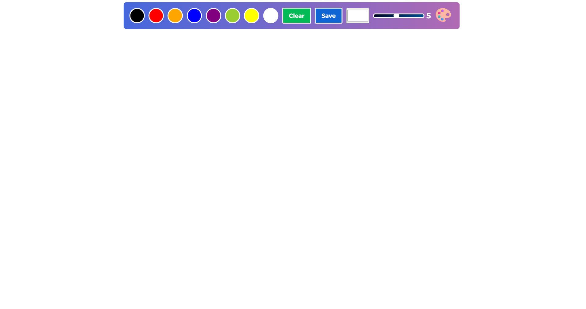

# 🖌️ Drawing Canvas WebApp

A lightweight and interactive drawing canvas web application built using **HTML**, **CSS**, and **JavaScript**. Designed for creative expression, this app allows users to draw freely with adjustable colors and canvas background options.

---

## 🔧 Features

- 🎨 Freehand drawing with mouse drag
- 🌈 Custom brush color selection
- 🖼️ Background color changing option
- 🧹 Clear canvas with a single click
- Responsive and clean user interface

---

## 🚀 Tech Stack

- **HTML5**
- **CSS3**
- **JavaScript (Vanilla)**

---

## 📸 Preview

> _"A simple yet powerful tool to unleash your inner artist!"_

<details>
  <summary>Click For Image Preview</summary>

  <br>

  

</details>


---

## 📂 Folder Structure

```
Drawing-Canvas-WebApp/
├── index.html # Main HTML file for the canvas app
├── style.css # Stylesheet for the app
├── app.js # JavaScript logic for drawing and interactivity
├── preview.png # Preview image of the app
└── README.md # Project documentation (this file)
```

---

## 🛠️ How to Use

1. **Clone the repository**
   ```bash
   git clone https://github.com/shaswatacharya/Drawing-Canvas-WebApp.git
   ```

2. **Navigate to the project folder**
   ```bash
   cd Drawing-Canvas-WebApp
   ```

3. **Open `index.html` in your browser**  
   No server needed — it's a pure frontend app.

---

## 🌐 Live Demo
  
[🔗 Live Link](https://shaswatacharya.github.io/Drawing-Canvas-WebApp/)

---

## 🧠 Author

**Shaswat Acharya**  
- [🌐 Portfolio Website](https://shaswatacharya.com.np)  
- [📂 GitHub Profile](https://github.com/shaswatacharya)

---

## 📄 License

Feel free to use, modify, and share!

---

> Made with ❤️ by Shaswat — keep drawing, keep vibing!
